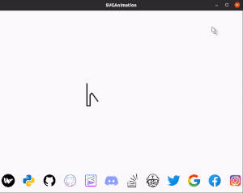

## SVG-Anim-Kivy
*Support for SVG in Kivy*

#




#
### Features in progress:
* SVG component-wise animation support


#

### No more dependency on png - works out of the box for svg
Now you can take some of the advantages svg offers in your kivy apps. Those are:
- [x] Compact file size compare to other formats
- [x] Scalability
- [x] And some animation( Path animation )
#
### How to use?
*Easy and Straightforward*

* Added option to draw image without animation, `animate=False`
* Added option to draw empty or filled path, `fill=True` or `fill=False`


```python
s = SVGAnimation(widget_to_draw_svg_upon)

# call draw method with a `svg_file` name
s.draw("github.svg", fill=True, animate=True)

```
### Requirement other than Kivy
* svg.path

### How to run demo?
**Note**: Demo code needs KivyMD to be installed. If you don't have(or don't want to install) kivymd then replace `MDIconButton` with your custom button and make sure to have a white background for widget because drawing color is black by default

* Clone it: `git clone https://github.com/shashi278/svg-anim-kivy.git`
* Change dir: `cd svg-anim-kivy`
* Install extra requirement: `pip install -r requirements.txt`
* Go to `src`: `cd src`
* Run it: `python demo.py`

#
#### PS: Try not to use very complex SVGs as they may degrade the performance
